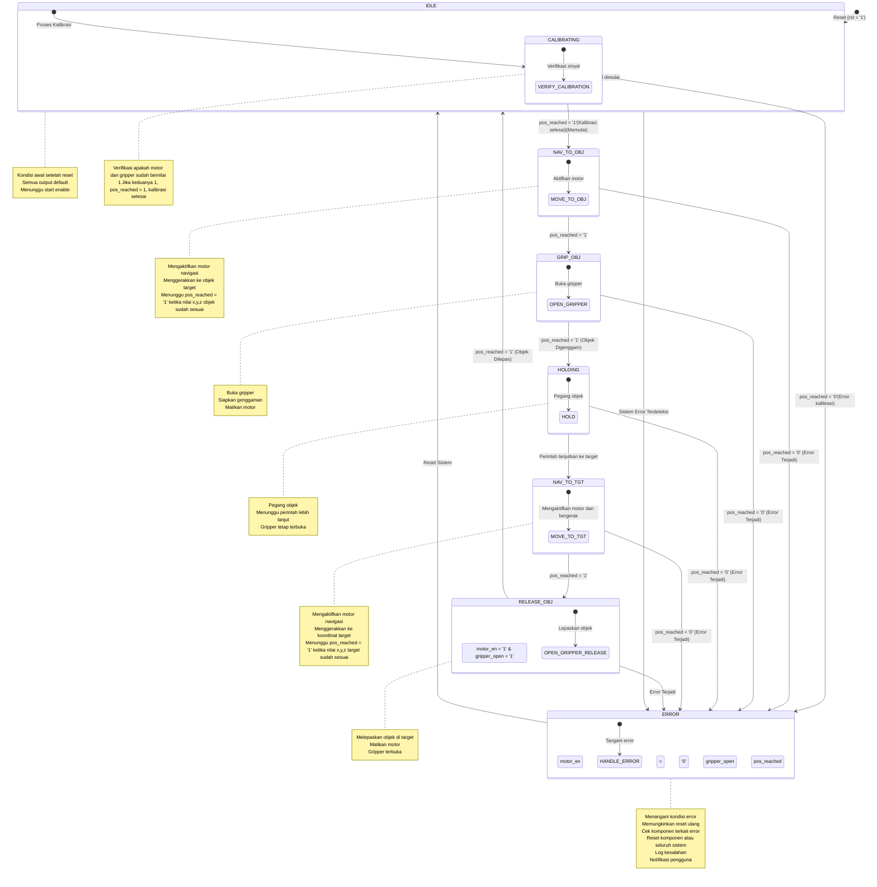

<<<<<<< HEAD
# Final Project PSD PA27 - Sistem Kendali Robot Arm pada VHDL

## 1. Latar Belakang
Proyek ini bertujuan untuk mengimplementasikan sistem kendali robot arm menggunakan VHDL (VHSIC Hardware Description Language), sebuah bahasa yang digunakan untuk menggambarkan sistem digital yang memungkinkan desain hardware untuk diuji dan diterapkan pada FPGA (Field Programmable Gate Array). Robot arm adalah perangkat keras yang digunakan dalam berbagai aplikasi industri, seperti pengangkatan, perakitan, dan pengelolaan objek. Sistem kendali robot arm ini bertujuan untuk memungkinkan robot beroperasi secara otomatis, dengan kemampuan untuk menavigasi, mengambil, dan melepaskan objek ke lokasi yang ditentukan.

Desain ini mengandalkan beberapa teknik utama dalam VHDL, seperti Microprogramming untuk modularitas, Finite State Machine (FSM) untuk manajemen status operasional robot, dan penggunaan Decoder untuk memproses input koordinat objek dan target. Pendekatan ini memungkinkan desain sistem yang fleksibel, efisien, dan mudah diuji. Sistem ini juga dapat dikembangkan lebih lanjut untuk aplikasi yang lebih kompleks, seperti integrasi sensor atau interaksi dengan perangkat lain.

## 2. Bagaimana Sistem Bekerja

### 2.1 Struktur Sistem
Sistem ini terdiri dari beberapa modul utama yang saling terintegrasi untuk menghasilkan fungsionalitas robot arm. Setiap modul memiliki tugas tertentu dalam proses pengoperasian robot arm, seperti menerima input, melakukan perhitungan navigasi, dan mengelola status sistem. Sistem ini menerima input dalam bentuk koordinat 3D (x, y, z) untuk objek dan target yang akan dicapai oleh robot arm, dengan menggunakan input 48-bit yang dikelola dan didekode menggunakan microprogramming untuk memisahkan koordinat objek dan target.

**Modul Utama dalam Sistem:**

**1. Top-Level Entity**  

Modul utama ini bertugas untuk menghubungkan dan mengelola interaksi antara semua modul lainnya dalam sistem, termasuk menerima input eksternal dan mengendalikan sinyal output. Modul ini akan menyambungkan modul-modul seperti **Input Decoder**, **Navigator**, **FSM**, dan **Display Segment**.

Tugas Utama:
- Mengatur komunikasi antar modul yang berbeda.
- Mengelola sinyal input dari luar (misalnya, `input_data` dan `start`).
- Menghasilkan sinyal output untuk kendali robot (misalnya, `motor_en`, `gripper_open`, `state_out`, dll.).
- Menyambungkan sinyal status dari FSM dan Navigator ke output utama (posisi robot, error, status FSM).

---

**2. Input Decoder (Microprogramming)**  

Modul **Input Decoder** bertugas untuk memproses data koordinat yang diterima sebagai input gabungan 48-bit. Data ini memuat informasi koordinat objek (x_obj, y_obj, z_obj) dan target (x_target, y_target, z_target), yang kemudian akan dipisahkan dan didistribusikan ke modul **Navigator**.

    Teori Input Koordinat 3D:  
    Koordinat dalam sistem ini menggunakan sistem koordinat tiga dimensi (3D), yang terdiri dari tiga nilai untuk setiap titik, yaitu:
    - x: Posisi pada sumbu horizontal.
    - y: Posisi pada sumbu vertikal.
    - z: Posisi pada sumbu kedalaman (depan-belakang).

    Microprogramming untuk Mendecode Input 48-bit:  
    Input 48-bit terdiri dari dua bagian:
    - 24 bit pertama untuk koordinat objek (x_obj, y_obj, z_obj).
    - 24 bit berikutnya untuk koordinat target (x_target, y_target, z_target).

    Microprogramming digunakan untuk mengonversi bit-bit tersebut menjadi nilai koordinat 3D. Setiap 8-bit didekode menjadi nilai integer yang mewakili posisi pada sumbu x, y, atau z.

Tugas Utama:
- Menerima input dalam bentuk 48-bit (`input_data`) yang berisi koordinat objek dan target.
- Menggunakan microprogramming untuk memisahkan input 48-bit menjadi 6 nilai koordinat (3 untuk objek dan 3 untuk target).
- Mendistribusikan informasi yang telah didekode ke modul **Navigator** untuk digunakan dalam penggerakan robot.

---

**3. Navigator**  

Modul **Navigator** bertugas untuk melakukan navigasi robot arm berdasarkan perbandingan antara posisi saat ini dengan posisi target dan objek. Dengan demikian, modul ini akan memastikan robot bergerak menuju posisi yang diinginkan, dan mengontrol sinyal motor untuk memandu robot bergerak.

Tugas Utama:
- Menerima koordinat target dan objek dari **Input Decoder**.
- Mengatur pergerakan robot berdasarkan posisi saat ini dan target.
- Mengaktifkan motor untuk bergerak menuju posisi target.
- Menghasilkan sinyal **pos_reached** yang menandakan apakah robot telah mencapai posisi target atau belum.

---

**4. Finite State Machine (FSM)**  

Modul **FSM** mengatur status dan transisi sistem berdasarkan peristiwa yang terjadi, serta kontrol keseluruhan dari robot arm. FSM mengontrol langkah-langkah operasi robot, seperti bergerak menuju objek, menggenggam objek, bergerak ke target, dan melepaskan objek.

Tugas Utama:
- Mengelola status robot melalui serangkaian kondisi (state), seperti IDLE, CALIBRATING, NAV_TO_OBJ, GRIP_OBJ, HOLDING, NAV_TO_TGT, RELEASE_OBJ, dan ERROR.
- Mengontrol transisi antar status berdasarkan input dari sinyal `start` dan `pos_reached`.
- Menghasilkan sinyal kontrol seperti `motor_en` dan `gripper_open` untuk mengendalikan motor dan gripper.
- Menghasilkan `state_out` yang merepresentasikan status robot dalam bentuk 3-bit, dan `error_out` yang menunjukkan jika terjadi kesalahan dalam sistem.

---

**5. Display Segment**  

Modul **Display Segment** bertugas untuk menampilkan status robot dalam bentuk visual menggunakan display 7-segment berdasarkan status yang diterima dari FSM.

Tugas Utama:
- Menerima status FSM (`state_in`) yang berupa sinyal 3-bit.
- Mengonversi status FSM menjadi sinyal yang dapat ditampilkan pada display 7-segment.
- Menampilkan status robot (misalnya, IDLE, CALIBRATING, GRIP_OBJ, dll.) sesuai dengan keadaan yang ada.

---

### 2.2 Alur Kerja Sistem Berdasarkan FSM
FSM mengelola alur kerja robot arm melalui beberapa status:

- **IDLE**: Menunggu sinyal perintah untuk mulai bergerak.
- **CALIBRATING**: Proses kalibrasi sistem robot arm.
- **NAV_TO_OBJ**: Robot bergerak menuju objek.
- **GRIP_OBJ**: Robot menggenggam objek setelah mencapai koordinat objek.
- **HOLDING**: Robot memegang objek dan menunggu perintah lebih lanjut.
- **NAV_TO_TGT**: Robot bergerak menuju target.
- **RELEASE_OBJ**: Robot melepaskan objek setelah mencapai target.
- **ERROR**: Sistem berada dalam keadaan error (misalnya, kegagalan kalibrasi atau error gerakan).

**Diagram Alur FSM**

### 2.3 Diagram Alur FSM
FSM berfungsi untuk memastikan bahwa robot arm selalu berada dalam satu status yang jelas pada setiap waktu. Dengan memeriksa kondisi seperti `pos_reached` atau `error_flag`, robot dapat berpindah status sesuai kebutuhan.

## 3. Cara Penggunaan

### 3.1 Tabel Input dan Output Harapan
Tabel berikut menjelaskan cara menggunakan sistem kendali robot arm ini melalui input dan output yang diharapkan pada setiap langkah.

| No. | Input Testbench                                                        | Deskripsi                                                                                          | Output Harapan                                                                                                 |
|-----|-------------------------------------------------------------------------|----------------------------------------------------------------------------------------------------|-----------------------------------------------------------------------------------------------------------------|
| 1   | rst = '1'                                                              | Reset sistem                                                                                        | Semua sinyal output (pos_reached, gripper_open, motor_en, dll.) direset ke nilai default. FSM berada di state IDLE. |
| 2   | rst = '0'                                                              | Reset selesai                                                                                       | Sistem siap menerima input. FSM tetap di state IDLE, menunggu sinyal start.                                    |
| 3   | input_data = "000000000001010000000101000001100011001100"   start = '1' | Input data koordinat: Objek (10, 20, 30), Target (50, 40, 60). Mulai navigasi.                      | FSM berpindah dari IDLE ke CALIBRATING. FSM kemudian berpindah ke NAV_TO_OBJ setelah kalibrasi selesai.         |
| 4   | FSM berada di CALIBRATING                                              | Proses Kalibrasi sedang berjalan                                                                   | FSM tetap di CALIBRATING hingga motor dan gripper bernilai 1. Output: motor_en = '1', gripper_open = '1', pos_reached = '1'. |
| 5   | FSM berpindah ke NAV_TO_OBJ                                            | Kalibrasi selesai                                                                                  | FSM berpindah ke NAV_TO_OBJ. Navigasi robot dimulai menuju koordinat objek (10, 20, 30). Output: motor_en = '1', pos_reached = '0'. |
| 6   | FSM mencapai koordinat objek (10, 20, 30)   pos_reached = '1'        | Objek tercapai                                                                                     | FSM berpindah ke GRIP_OBJ. Output: gripper_open = '1' untuk mengambil objek, motor_en = '0'.                    |
| 7   | FSM berpindah ke HOLDING                                               | Objek digenggam                                                                                   | FSM berada di HOLDING. Gripper tetap terbuka, menunggu perintah lebih lanjut.                                |
| 8   | FSM berpindah ke NAV_TO_TGT: Robot bergerak menuju koordinat target (50, 40, 60). | Navigasi menuju target                                                                               | FSM berada di state NAV_TO_TGT. Output: motor_en = '1', pos_reached = '0'. x_out, y_out, z_out menuju target (50, 40, 60). |
| 9   | FSM mencapai koordinat target (50, 40, 60)   pos_reached = '1'        | Target tercapai                                                                                   | FSM berpindah ke RELEASE_OBJ. Output: gripper_open = '0' untuk melepaskan objek, motor_en = '0'.                |
| 10  | FSM kembali ke state IDLE setelah objek dilepaskan.                    | Sistem menunggu perintah baru                                                                       | FSM kembali ke state IDLE. Semua sinyal output kembali ke nilai default: motor_en = '0', gripper_open = '0', pos_reached = '0'. |

### 3.2 Output 7-Segment Display
Status FSM akan ditampilkan pada 7-segment display dengan format berikut:

| State        | Tampilan 7-Segment (Bit) |
|--------------|--------------------------|
| IDLE         | 0001                     |
| CALIBRATING  | 0010                     |
| NAV_TO_OBJ   | 0011                     |
| GRIP_OBJ     | 0100                     |
| HOLDING      | 0101                     |
| NAV_TO_TGT   | 0110                     |
| RELEASE_OBJ  | 0111                     |
| ERROR        | 0000                     |
=======
# PA27_PSD
>>>>>>> bc67fd79f50dc89bca399d20f9efb85943f1f2b5
